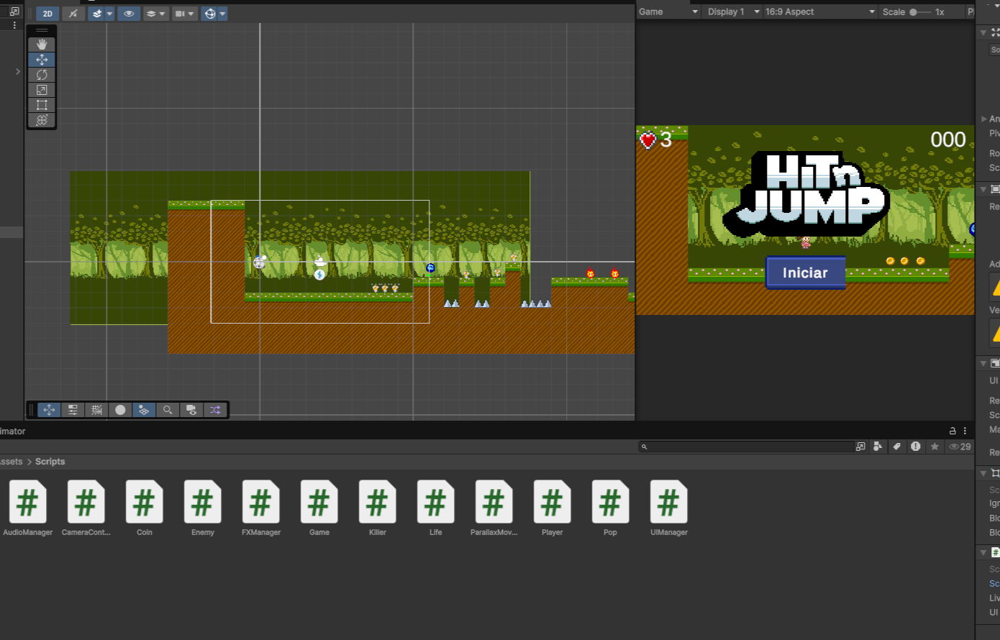
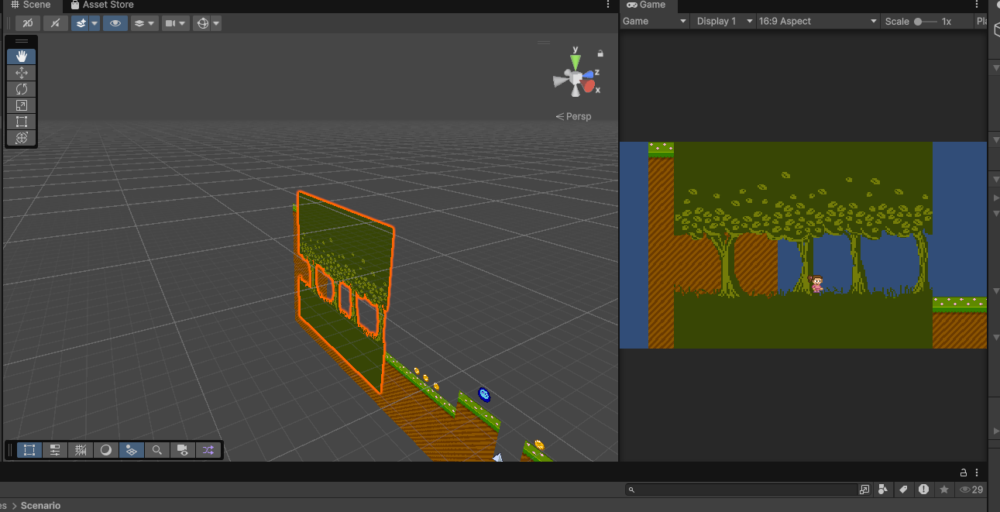
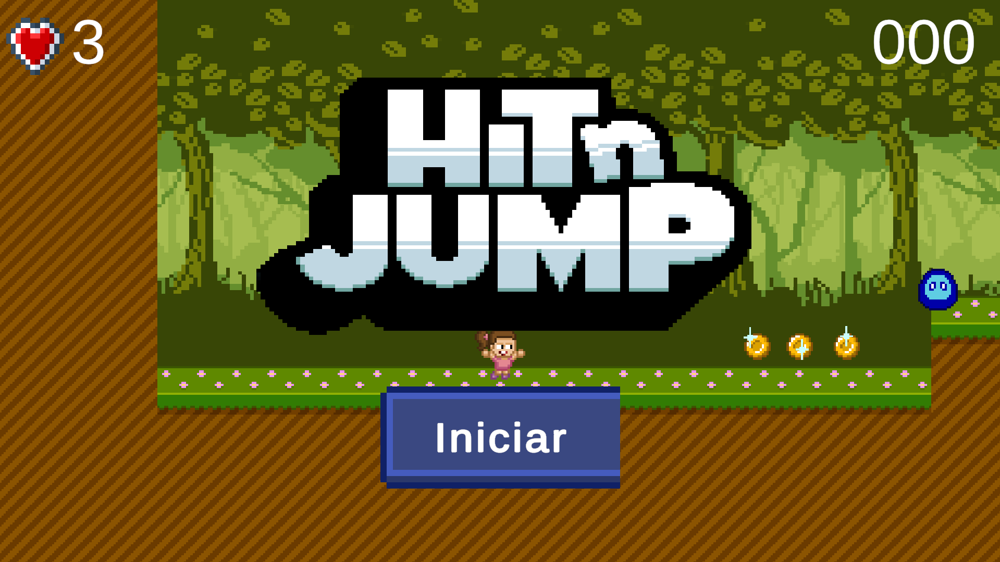

# Hit n' Run - Project for Web Videogame Course

---

### Select Language / Seleccionar Idioma
[English Version](#english-version) | [Versión en Español](#version-en-español)

---

## English Version

<strong>Click to expand / collapse English documentation</strong>

### Project Overview
Welcome to **Hit n' Run**! This project was developed as part of a web videogame creation course. It is a platform/action game built using the **Unity** engine and exported to **WebGL** format to be played directly in the browser.

### Objectives
This game was created to learn the fundamentals of game development, including:
- Physics and character controller management.
- Level design using **Tilemaps**.
- Implementation of dynamic camera systems.
- Functional User Interface (UI) creation.
- Optimization and export for web platforms.

### Screenshots

#### Gameplay
A view of the main game action, showing the character and obstacles in real-time.

#### Level Design (Tilemap and Background)
Technical detail of the level design, showcasing the use of Tilemap layers for terrain and decorative elements, along with a dynamic background.

#### Final User Interface
Display of the implemented UI, including the HUD (Heads-Up Display) and visual interaction elements.

### How to Run
To test the game locally:
1. Clone this repository or download the folder.
2. Open the `index.html` file in a browser (using a local server like VS Code *Live Server* or `npx serve` is recommended to avoid CORS issues with WebGL).
3. Enjoy the experience!

**Developed by:** DragonGames
*Educational project.*

---

## Versión en Español

<strong>Haz clic para expandir / contraer la documentación en español</strong>

### Resumen del Proyecto
¡Bienvenido a **Hit n' Run**! Este proyecto fue desarrollado como parte de un curso de creación de videojuegos web. Es un juego de plataformas/acción construido con el motor **Unity** y exportado a formato **WebGL** para ser jugado directamente en el navegador.

### Objetivos
Este juego fue creado con el objetivo de aprender las bases del desarrollo de videojuegos, incluyendo:
- Manejo de físicas y controladores de personajes.
- Diseño de niveles utilizando **Tilemaps**.
- Implementación de sistemas de cámaras dinámicas.
- Creación de interfaces de usuario (UI) funcionales.
- Optimización y exportación para plataformas web.

### Capturas de Pantalla

#### Gameplay
Una vista de la acción principal del juego, mostrando al personaje y los obstáculos en tiempo real.

#### Diseño de Niveles (Tilemap y Fondo)
Detalle técnico del diseño del nivel, donde se puede apreciar el uso de capas de Tilemaps para el suelo y elementos decorativos, junto con un fondo dinámico.

#### Interfaz de Usuario Final
Muestra de la UI implementada, incluyendo el HUD (Heads-Up Display) y otros elementos visuales de interacción.

### DEMO 
Para probar el juego :
https://dragon88888888888.github.io/curso-videojuego-web/

**Desarrollado por:** DragonGames
*Proyecto realizado con fines educativos.*

